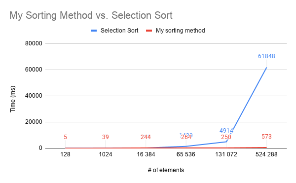

# Sorting-Algorithms-Class
This is simply a class that can be used as an object to access several different sorting methods that I created myself.  (and yes i know some Aren't original, but I Brain stormed them myself)
In the graphic below, I compiled test data from two of the sorting methods within the classfile.  

The two being my fastest (quick bubble sort) which I made completley myself, and the other is Selection sort which I made as a practice method.  

